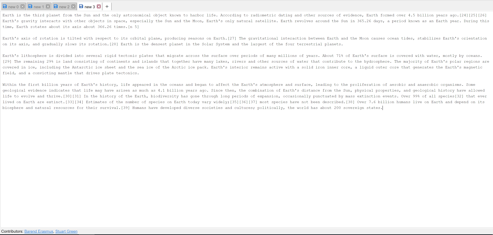

# Offline Notepad
Offline-first Notepad with built in syncing

 

[View Live](https://offline-notepad.com/index.html)

## Features

*  Multiple Tabs
*  IndexedDB Persistent Layer
*  Autosave
*  Google Analytics
*  Support Edge
*  Modify Tab Names
*  Export / Download
*  Offline Caching using Service Worker
*  Sync using GoogleAuth
*  Line Numbers
*  Drag & Drop Tabs
*  Tab(Tabulator) Key
*  Recover Closed Tabs

## Release History

* 0.1.1 (2018-08-28)
    * Initial Release
* 0.1.3 (2018-08-29)
    * CHANGE: IndexedDB to PouchDB backed by CouchDB
* 0.1.4 (2018-08-30)
    * CHANGE: Modify Tab Names
    * CHANGE: Sync using GoogleAuth
* 0.1.5 (2018-08-31)
    * CHANGE: Support Edge
* 0.1.6 (2018-09-01)
    * CHANGE: Drag & Drop Tabs
* 0.1.7 (2018-09-05)
    * CHANGE: Optimizations
* 0.1.8 (2018-09-06)
    * CHANGE: Line Numbers

## Dependencies

* [@angular/animations](https://www.npmjs.com/package/@angular/animations) - Angular - animations integration with web-animations
* [@angular/common](https://www.npmjs.com/package/@angular/common) - Angular - commonly needed directives and services
* [@angular/compiler](https://www.npmjs.com/package/@angular/compiler) - Angular - the compiler library
* [@angular/core](https://www.npmjs.com/package/@angular/core) - Angular - the core framework
* [@angular/forms](https://www.npmjs.com/package/@angular/forms) - Angular - directives and services for creating forms
* [@angular/http](https://www.npmjs.com/package/@angular/http) - Angular - the http service
* [@angular/platform-browser](https://www.npmjs.com/package/@angular/platform-browser) - Angular - library for using Angular in a web browser
* [@angular/platform-browser-dynamic](https://www.npmjs.com/package/@angular/platform-browser-dynamic) - Angular - library for using Angular in a web browser with JIT compilation
* [@angular/router](https://www.npmjs.com/package/@angular/router) - Angular - the routing library
* [core-js](https://www.npmjs.com/package/core-js) - Standard library
* [idb](https://www.npmjs.com/package/idb) - IndexedDB but with promises
* [rxjs](https://www.npmjs.com/package/rxjs) - Reactive Extensions for modern JavaScript
* [zone.js](https://www.npmjs.com/package/zone.js) - Zones for JavaScript

### Dev Dependencies

* [@angular-devkit/build-angular](https://www.npmjs.com/package/@angular-devkit/build-angular) - Angular Webpack Build Facade
* [@angular/cli](https://www.npmjs.com/package/@angular/cli) - CLI tool for Angular
* [@angular/compiler-cli](https://www.npmjs.com/package/@angular/compiler-cli) - Angular - the compiler CLI for Node.js
* [@angular/language-service](https://www.npmjs.com/package/@angular/language-service) - Angular - language services
* [@types/jasmine](https://www.npmjs.com/package/@types/jasmine) - TypeScript definitions for Jasmine
* [@types/jasminewd2](https://www.npmjs.com/package/@types/jasminewd2) - TypeScript definitions for jasminewd2
* [@types/node](https://www.npmjs.com/package/@types/node) - TypeScript definitions for Node.js
* [@types/pouchdb](https://www.npmjs.com/package/@types/pouchdb) - TypeScript definitions for pouchdb
* [codelyzer](https://www.npmjs.com/package/codelyzer) - Linting for Angular applications, following angular.io/styleguide.
* [jasmine-core](https://www.npmjs.com/package/jasmine-core) - Official packaging of Jasmine's core files for use by Node.js projects.
* [jasmine-spec-reporter](https://www.npmjs.com/package/jasmine-spec-reporter) - Spec reporter for jasmine behavior-driven development framework
* [karma](https://www.npmjs.com/package/karma) - Spectacular Test Runner for JavaScript.
* [karma-chrome-launcher](https://www.npmjs.com/package/karma-chrome-launcher) - A Karma plugin. Launcher for Chrome and Chrome Canary.
* [karma-coverage-istanbul-reporter](https://www.npmjs.com/package/karma-coverage-istanbul-reporter) - A karma reporter that uses the latest istanbul 1.x APIs (with full sourcemap support) to report coverage.
* [karma-jasmine](https://www.npmjs.com/package/karma-jasmine) - A Karma plugin - adapter for Jasmine testing framework.
* [karma-jasmine-html-reporter](https://www.npmjs.com/package/karma-jasmine-html-reporter) - A Karma plugin. Dynamically displays tests results at debug.html page
* [pouchdb](https://www.npmjs.com/package/pouchdb) - PouchDB is a pocket-sized database
* [prettier](https://www.npmjs.com/package/prettier) - Prettier is an opinionated code formatter
* [protractor](https://www.npmjs.com/package/protractor) - Webdriver E2E test wrapper for Angular.
* [ts-node](https://www.npmjs.com/package/ts-node) - TypeScript execution environment and REPL for node.js, with source map support
* [tslint](https://www.npmjs.com/package/tslint) - An extensible static analysis linter for the TypeScript language
* [typescript](https://www.npmjs.com/package/typescript) - TypeScript is a language for application scale JavaScript development

## Contributors

* [Barend Erasmus](https://www.linkedin.com/in/developersworkspace)
* [Stuart Green](https://www.linkedin.com/in/stuartngreen)
* [Storm Simmons](https://www.linkedin.com/in/storm-simmons-65b819119)

## Contribute

1. [Fork it](https://github.com/barend-erasmus/offline-notepad/fork)
2. Create your feature branch (`git checkout -b feature/your-feature`)
3. Commit your changes (`git commit -am 'Description of your feautre'`)
4. Push to the branch (`git push origin feature/your-feature`)
5. Create a new pull request