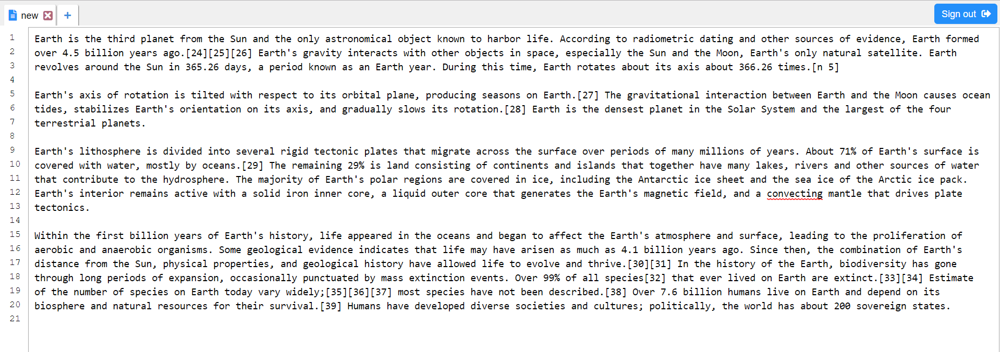

# Offline Notepad
Offline-first Notepad with built in syncing

[View Live](https://offline-notepad.com/index.html)

## Features

*  Multiple Tabs
*  IndexedDB Persistent Layer
*  Autosave
*  Google Analytics
*  Support IE/Edge
*  Modify Tab Names
*  Export / Download
*  Offline Caching using Service Worker
*  Sync using GoogleAuth
*  Line Numbers

## Release History

* 0.1.1 (2018-08-28)
    * Initial Release
* 0.1.3 (2018-08-29)
    * CHANGE: IndexedDB to PouchDB backed by CouchDB
* 0.1.4 (2018-08-30)
    * CHANGE: Sync using GoogleAuth
* 0.1.5 (2018-08-31)
    * CHANGE: Support IE/Edge

## Contributors

* [Barend Erasmus](https://www.linkedin.com/in/developersworkspace)
* [Stuart Green](https://www.linkedin.com/in/stuartngreen)

## Contribute

1. [Fork it](https://github.com/barend-erasmus/offline-notepad/fork)
2. Create your feature branch (`git checkout -b feature/your-feature`)
3. Commit your changes (`git commit -am 'Description of your feautre'`)
4. Push to the branch (`git push origin feature/your-feature`)
5. Create a new pull request